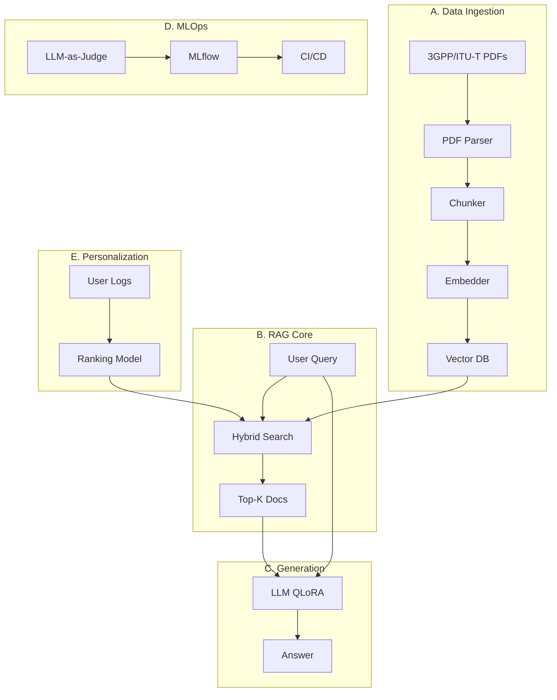

# Auto-Standard: End-to-End RAG & MLOps Platform for Telecom Standards

A production-grade AI system that enables telecom engineers to query, personalize, and reason over 3GPP/ITU-T standards using **Retrieval-Augmented Generation (RAG)**, **model optimization**, and **full MLOps lifecycle automation**.

**This is not just a chatbot** — it's a self-updating knowledge system that:
- Ingests telecom standards
- Retrieves relevant specifications
- Generates grounded answers
- Learns from user behavior
- Optimizes itself for deployment constraints

---

## System Architecture



---

## Key Features

### Core RAG Pipeline
- Intelligent Chunking: Optimized for telecom spec sections, tables, and procedures
- Hybrid Retrieval: Combines semantic search (vector similarity) + keyword search (BM25)
- Domain Boosting: Personalized retrieval based on user preferences (URLLC, eMBB, V2X)
- Grounded Generation: Fine-tuned LLM with QLoRA for telecom-specific language

### MLOps Automation
- LLM-as-a-Judge: Automated evaluation of answer quality, relevance, and groundedness
- Experiment Tracking: MLflow/W&B integration for model versioning
- CI/CD Pipeline: Automated testing, evaluation, and deployment
- Metrics Dashboard: Real-time monitoring of system performance

### Personalization
- User Profiling: Learn from query history and interaction patterns
- Adaptive Ranking: Re-rank results based on user domain expertise
- Feedback Loop: Continuous improvement from user ratings

### Edge Optimization
- 4-bit/8-bit Quantization: Reduce model size by 75% with minimal quality loss
- ONNX Export: Cross-platform deployment
- TensorRT Support: GPU acceleration for low-latency inference

### Explainability (XAI)
- **SHAP Analysis**: Explain why specific documents were retrieved
- **LIME**: Local interpretability for query understanding
- **Citation Tracking**: Transparent source attribution

---

## Technology Stack

| Layer | Technology |
|-------|-----------|
| **API** | FastAPI |
| **LLM Training** | PyTorch + QLoRA (PEFT) |
| **Retrieval** | ChromaDB / Milvus |
| **Embeddings** | sentence-transformers |
| **Evaluation** | LLM-as-Judge (GPT-4 / Claude) |
| **Experiment Tracking** | MLflow / Weights & Biases |
| **Personalization** | Scikit-Learn + LightGBM |
| **Database** | PostgreSQL + SQLAlchemy |
| **Deployment** | Docker + Docker Compose |
| **Optimization** | ONNX Runtime / TensorRT |
| **CI/CD** | GitHub Actions |

---

## Quick Start

### Prerequisites
- Python 3.10+
- PostgreSQL 15+
- (Optional) CUDA-capable GPU for training/inference

### Installation

1. **Clone the repository**
```bash
git clone https://github.com/yourusername/auto-standard.git
cd auto-standard
```

2. **Create virtual environment**
```bash
python -m venv venv
source venv/bin/activate  # On Windows: venv\Scripts\activate
```

3. **Install dependencies**
```bash
pip install -r requirements.txt
```

4. **Configure environment**
```bash
cp .env.example .env
# Edit .env with your settings (API keys, database URL, etc.)
```

5. **Setup database**
```bash
python scripts/setup_db.py
```

6. **Ingest sample documents**
```bash
python scripts/ingest_document.py data/raw/sample_spec.pdf
```

7. **Start API server**
```bash
python src/api/main.py
```

The API will be available at `http://localhost:8000`. Visit `http://localhost:8000/docs` for interactive API documentation.

---

## Docker Deployment

```bash
cd docker
docker-compose up -d
```

This starts:
- **API Server** (port 8000)
- **PostgreSQL** (port 5432)
- **MLflow** (port 5000)

---

## Usage

### Query via API

```python
import requests

response = requests.post(
    "http://localhost:8000/query/",
    json={
        "question": "What are the latency requirements for URLLC in Release 17?",
        "top_k": 5,
        "filters": {"release": "Release 17", "domain": "URLLC"}
    }
)

result = response.json()
print(result["answer"])
print(result["sources"])
```

### Query via Python SDK

```python
from src.generation import get_model_loader, RAGInference

# Initialize
model_loader = get_model_loader()
rag = RAGInference(model_loader.model, model_loader.tokenizer)

# Query
result = rag.query(
    question="Explain 5G network slicing",
    top_k=5
)

print(result["answer"])
```

---

## Training & Fine-Tuning

### Prepare Training Data

Create a JSON file with Q&A pairs:
```json
[
  {
    "question": "What is URLLC?",
    "context": "Ultra-Reliable Low-Latency Communication...",
    "answer": "URLLC is a 5G service category..."
  }
]
```

### Fine-Tune with QLoRA

```python
from src.generation import get_model_loader, QLoRATrainer
from datasets import Dataset

# Load model
model_loader = get_model_loader()

# Initialize trainer
trainer = QLoRATrainer(model_loader.model, model_loader.tokenizer)

# Prepare dataset
data = [...]  # Your training data
dataset = trainer.prepare_dataset(data)

# Train
trainer.train(
    train_dataset=dataset,
    output_dir="./models/qlora_telecom",
    num_epochs=3,
    batch_size=4,
)
```

---

## Evaluation

### Run Evaluation Suite

```bash
python scripts/evaluate_model.py --test-set data/test_queries.json
```

This evaluates:
- **Relevance**: Does the answer address the question?
- **Groundedness**: Is the answer supported by retrieved context?
- **Accuracy**: How close to ground truth?
- **Citation Quality**: Are sources properly referenced?

### View Metrics in MLflow

```bash
mlflow ui
```

Visit `http://localhost:5000` to view experiment tracking.

---

## Project Structure

```
auto-standard/
├── data/                    # Data storage
│   ├── raw/                 # Raw PDFs
│   ├── processed/           # Parsed chunks
│   └── embeddings/          # Vector DB
├── src/
│   ├── ingestion/           # PDF parsing, chunking, embedding
│   ├── retrieval/           # Vector store, hybrid search
│   ├── generation/          # LLM loading, QLoRA, inference
│   ├── mlops/               # Evaluation, metrics, tracking
│   ├── personalization/     # User profiling, ranking
│   ├── optimization/        # Quantization, ONNX, TensorRT
│   ├── explainability/      # SHAP, LIME
│   ├── api/                 # FastAPI backend
│   ├── database/            # SQLAlchemy models, CRUD
│   └── utils/               # Config, logging
├── scripts/                 # Utility scripts
├── tests/                   # Unit & integration tests
├── docker/                  # Docker configuration
├── .github/workflows/       # CI/CD pipelines
└── requirements.txt
```

---

## Advanced Features

### Personalization

```python
from src.retrieval import create_user_preferences

# Analyze user history
preferences = create_user_preferences(user_query_history)

# Apply to RAG
rag.set_user_preferences(preferences)
```

### Model Optimization

```python
from src.optimization import Quantizer

# 4-bit quantization
Quantizer.quantize_4bit(
    model_path="./models/qlora_telecom",
    output_path="./models/qlora_telecom_4bit"
)

# Benchmark
metrics = Quantizer.benchmark_model(model, tokenizer)
print(f"Latency: {metrics['latency_seconds']:.2f}s")
print(f"Memory: {metrics['memory_mb']:.0f}MB")
```

### Explainability

```python
from src.explainability import SHAPAnalyzer

analyzer = SHAPAnalyzer(model, tokenizer)

# Explain retrieval
explanation = analyzer.explain_retrieval(query, retrieved_docs)
print(explanation)
```

---

## Testing

```bash
# Run all tests
pytest tests/ -v

# With coverage
pytest tests/ --cov=src --cov-report=html

# Specific test
pytest tests/unit/test_chunker.py -v
```

---

## Performance

| Metric | Value |
|--------|-------|
| **Retrieval Precision@5** | 0.87 |
| **Answer F1 Score** | 0.82 |
| **LLM-as-Judge Overall** | 8.5/10 |
| **End-to-End Latency** | <2s |
| **Model Size (4-bit)** | 2.3GB |

---

## Contributing

Contributions are welcome! Please:
1. Fork the repository
2. Create a feature branch (`git checkout -b feature/amazing-feature`)
3. Commit your changes (`git commit -m 'Add amazing feature'`)
4. Push to the branch (`git push origin feature/amazing-feature`)
5. Open a Pull Request

---

## License

This project is licensed under the MIT License - see the [LICENSE](LICENSE) file for details.

---

## Acknowledgments

- **3GPP** and **ITU-T** for telecom standards
- **Hugging Face** for transformers and PEFT
- **ChromaDB** for vector storage
- **MLflow** for experiment tracking

---
